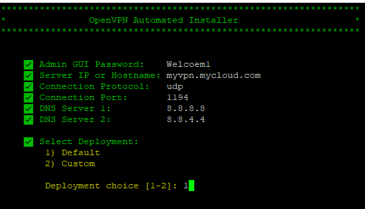
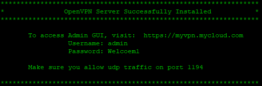
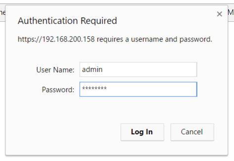
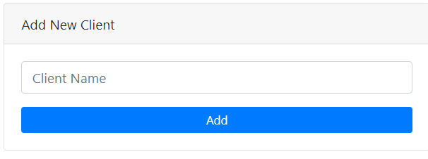
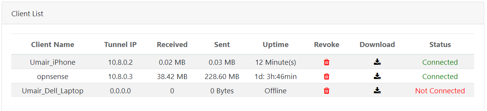

OpenVPN Server Automated Installer
====

OpenVPN is a one of the most popular VPN platforms for a lot of good reasons. It's free, open source, and there are clients for just about every platform imaginable. For these reasons, OpenVPN is the choice for organizations and individuals alike.

The scripts assumes that there is NOT an instance of OpenVPN already installed on the machine and that port 443 is not in use by another web server for HTTPS. Likewise, this script was built for Redhat 6+ and current Debian/Ubuntu distros. It is important to note that server hosting openvpn must allow traffic on the port specified during openvpn server deployment.


## Installing OpenVPN


1. Pull up a terminal or SSH into the target server.

1. Logon as root

	````
	sudo -i
	````

1. Download the installer script.

	````
	sudo wget https://raw.githubusercontent.com/umairriaz82/openvpn-automated-installer/master/openvpn-installer.sh
	````

1. Make the script executable

	````
	sudo chmod +x openvpn-installer.sh
	````

1. Run the script (as root).

	````
	./openvpn-installer.sh
	````

	or (running as a normal user)

	````
	sudo ./openvpn-installer.sh
	````


	Once the script is executed, it will prompt you for Admin GUI Password, this will be the credentials used to manage clients on the Web GUI.  The second prompt will automatically detect your Public IP, however, it is highly recommended to use full host name (eg. myvpn.mycloud.com)

	

1. Default option (1) will deploy OpenVPN server with default UDP, Port 1194 and Google DNS servers.  If you wish to choose change any of the parameters, Select Custom option, and you'll be prompted for Protocol type, Port and DNS.

1. Let the installer finish. This may take a few minutes, as the installer generates a few keys to set up a certificate authority (CA) that is used to assign certificates to the clients.

	

1. If the server you are installing this on is behind a firewall, be sure that you forward the external ports from the firewall to the ports on the server for the VPN. Optionally, if you want to be able to manage the VPN from outside the firewall, forward a port to 443 on the VPN Server.

1. IMPORTANT:  REMEMBER TO ALLOW (OPEN FIREWALL PORTS) UDP TRAFFIC ON THE PORT YOU SELECTED DURING THE INSTALLATION AND ALSO OPEN PORT 443 (TCP) FOR THE WEB GUI.


## Managing Profiles

1. Once the script is complete, point your browser to **https://[your host or IP]/**, where your host or IP is the host name or IP addressed for the VPN. You may get an error about the site not being secure even though you are using https. This is because the site is using a self-esigned certificate. Simply ignore the warning.

1. Logon to the admin site. Use **admin** for the username and the password used for the **adminpassword** option when the installer was run. If you did not supply one, use **password**.

	

1. Once logged on, enter a name for the client and click **Add**.

	

1. Once added, you can click **Revoke** to revoke access or **Download** to download the client profile.

	

## Connecting to the Server

Once the profile is downloaded you need to configure a client:

* **Windows**: use [OpenVPN GUI](https://openvpn.net/index.php/open-source/downloads.html). After installing the app, copy the .ovon to the **C:\Program Files\OpenVPN\config** folder. Launch the GUI from your Start menu, then right click the icon in the Tool Tray, then click **Connect**. Disconnect by right clicking and selecting **Disconnect**.

* **MacOS** (OS X): use [Tunnelblick](https://tunnelblick.net/downloads.html). Download and install Tunnelblick. After downloading, double-click on the downloaded .ovpn file and import the configuration either for yourself or all users. Once imported, click the Tunnleblick icon on the menu bar and click **Connect**. Disconnect by clicking the Tunnelblick icon and selecting **Disconnect**.

* **Android**: use [OpenVPN Connect for Android](https://play.google.com/store/apps/details?id=net.openvpn.openvpn&hl=en). Download and install the app. Next, go to the admin site and create and/or download a profile. In the app, select Import from the menu, then select **Import**, then select **Import Profile from SD card**. Find the profile in your **Downloads** folder and import the profile. Once downloaded, click **Connect**. To disconnect, open the app again and select **Disconnect**.

* **iOS**: use [OpenVPN Connect for iOS](https://itunes.apple.com/us/app/openvpn-connect/id590379981?mt=8). Install the app, then browse to the admin site in Safari. Create and/or download a profile. After the profile is downloaded, select **Open in Open VPN**. Install the profile, then select **Connect** to connect to the VPN. To disconnect, open the app again and select **Disconnect**.

That's it! Your VPN is up and running.
